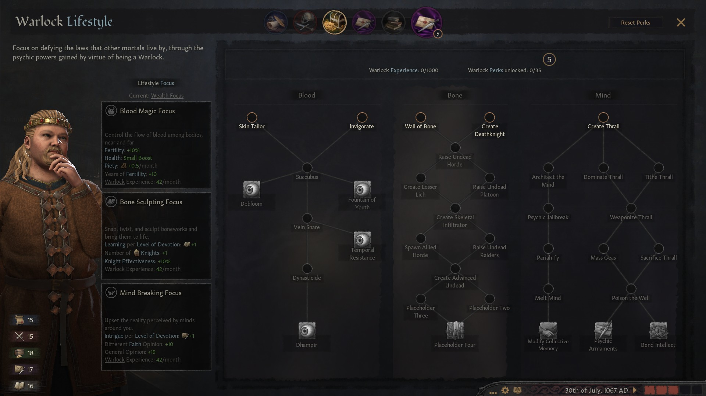

# Warlock

Learn how to become a warlock - a servant of an eldritch horror or cosmic entity.

**Recommended game version:** `1.4.4`. It may work on newer versions, but this is unsupported.

## License

 This work is licensed under a <a rel="license" href="http://creativecommons.org/licenses/by-nc-sa/4.0/">Creative Commons Attribution-NonCommercial-ShareAlike 4.0 International License</a>.

## Features

As a warlock, you will gain access to the following schools of magic:

- Blood
	+ Extend your life and fertility.
	+ Damage the life and fertility of others.
- Bone
	+ Create undead armies.
	+ Erect defences, buff your knights, etc.
- Mind
	+ Create thralls out of characters in the game.
	+ Manipulate others decisions.

	
## Getting Started

- Choose Decisions
- Choose the "Choose your Start" option
- Pick one of the three options:
	+ "I am an established Warlock" - the easiest start which sets you up as a fully fledged warlock.
	+ "I am a faithful Cultist" - a slightly harder start.
	+ "I am as I am now." - the hardest start. You'll have to earn your powers.

## Author

Originally created by [Skelletron](https://github.com/skelletron), published and maintained by [Cheb Gonaz](https://github.com/jpw1991).

Message from Cheb Gonaz:

> This mod was created for private use but it's so damn good I was able to convince Skelletron to allow me to make it public so that everyone may enjoy it and benefit from it.
>
> Skelletron has since moved on from CK3 modding and I don't have much time to invest into improving/maintaining this mod but I'll do my best. If you can help, please fork the [repository](https://github.com/skelletron/warlock) and make your changes and create a pull request for me to look at and approve.

## Install (manual)

Manual install [instructions](https://ck3.paradoxwikis.com/Modding#Installing_mods_manually).

### Linux

- Execute `install.sh`

### Windows

- Copy the mod's folder to `Documents\Paradox Interactive\Crusader Kings III\mod`

## To do:

- Implement final perks on the Bone tree:
	+ [bone tree: implement placeholder two](https://github.com/skelletron/warlock/issues/1)
	+ [bone tree: implement placeholder three](https://github.com/skelletron/warlock/issues/2)
	+ [bone tree: implement placeholder four](https://github.com/skelletron/warlock/issues/3)